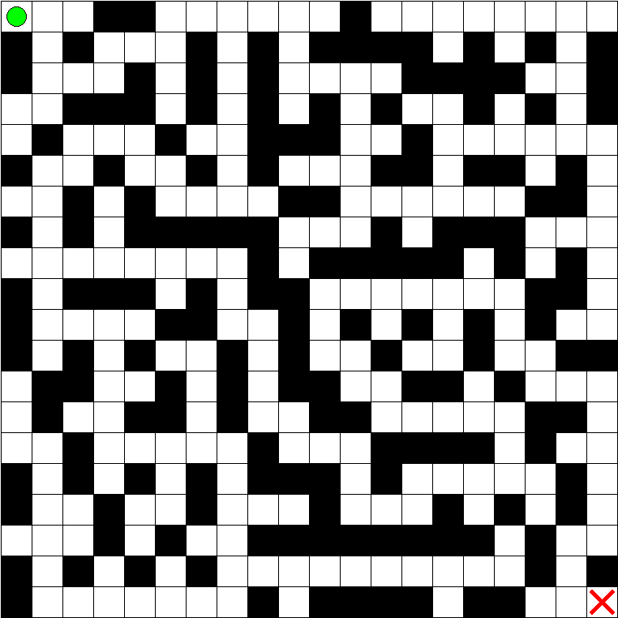
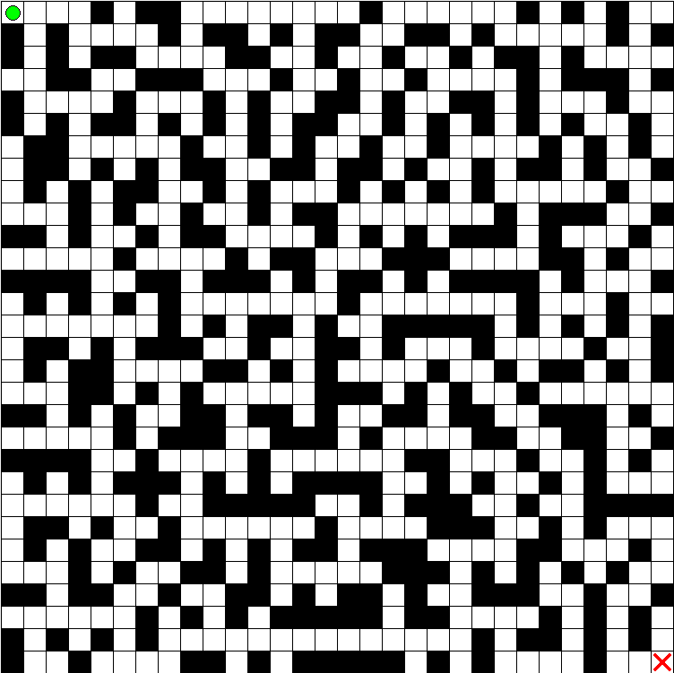
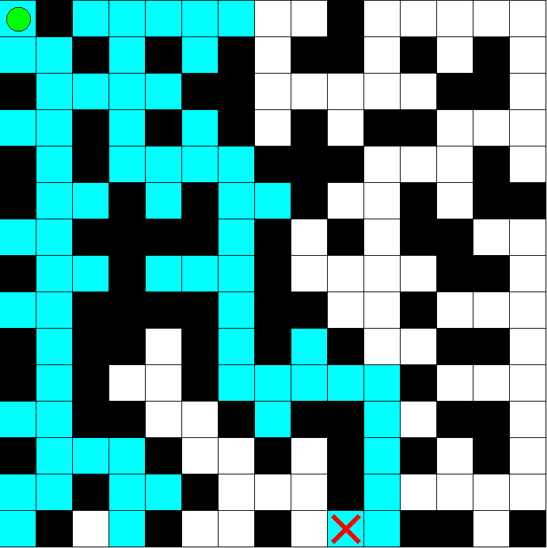

# Snaking Mazes

 

### By Sam Haggans
This is a maze generator and solver program that creates various different types of mazes. Users can either randomly generate mazes or manually design them. The program then can both allow the user to solve a maze or watch a pathfinding algorithm solve it. Mazes can also be shared between users.

## Installation Instructions
Built executables can be found in the [releases page](https://github.com/SamHaggans/snaking-mazes/releases/latest) on GitHub.
However, the program can also be easily run manually (tested on Python 3.6.8). If you have [pipenv](https://pypi.org/project/pipenv/), you can install dependencies with `pipenv install`, and then enter a shell in the created virtual environment with `pipenv shell`.
Dependencies can also be installed manually using `pip install pyqt6`, as PyQT is the only dependency necessary to run the application. 
Once these dependencies have been installed, the program can be run with `python -m src.main`. This should bring up the main GUI window.

